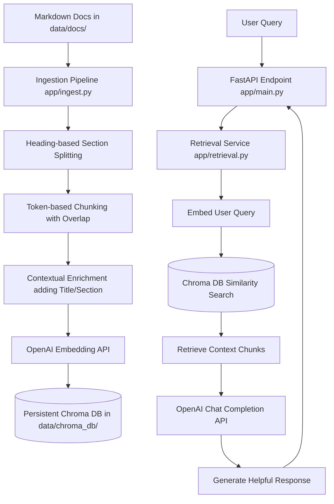

# Company Policy Assistant (RAG)

A Retrieval-Augmented Generation (RAG) assistant designed to search, retrieve, and answer natural language queries based on company policies (e.g., Software Access, Security, and Remote Work policies). 

This system parses markdown policy documents, splits them into logical context-aware sections, chunks them to fit LLM context limits, creates dense vector embeddings via OpenAI, and stores them in a local persistent Chroma DB vector database. It is designed to be queried via a FastAPI web service.

---

## 🏗️ Architecture & Data Flow



---

## 📁 Project Structure

```text
company-policy-assistant/
├── app/
│   ├── __init__.py
│   ├── ingest.py         # Parses docs, generates embeddings, and populates ChromaDB
│   ├── retrieval.py      # [To Implement] Logic for querying ChromaDB and RAG pipeline
│   └── main.py           # [To Implement] FastAPI server exposing query endpoints
├── data/
│   ├── docs/             # Company policy source documents
│   │   ├── access_policy.md
│   │   ├── remote_work_policy.md
│   │   └── security_policy.md
│   └── chroma_db/        # Local persistent vector database storage (Generated)
├── .env.example          # Sample environment configuration file
├── .gitignore            # Git exclusion rules
├── requirements.txt      # Python package dependencies
└── README.md             # Project documentation (This file)
```

---

## 🚀 Getting Started

### 1. Prerequisites
Ensure you have Python 3.10+ installed.

### 2. Setup Environment
Clone or navigate to the project directory and create a Python virtual environment:

```bash
# Create a virtual environment
python -m venv venv

# Activate it (Windows)
.\venv\Scripts\activate

# Activate it (macOS/Linux)
source venv/bin/activate
```

### 3. Install Dependencies
Install all required packages from `requirements.txt`:

```bash
pip install -r requirements.txt
```

### 4. Configuration
Create a `.env` file from the example template:

```bash
cp .env.example .env
```

Configure your environment variables in the newly created `.env`:
```ini
OPENAI_API_KEY=your_actual_openai_api_key_here
OPENAI_EMBEDDING_MODEL=text-embedding-3-small
OPENAI_CHAT_MODEL=gpt-4o  # Or your preferred chat model
```

---

## 📥 Ingestion Pipeline (`app/ingest.py`)

The ingestion pipeline parses the markdown policy documents in `data/docs/` and builds the vector store.

### Key Operations:
1. **Markdown Header Splitting**: Splits files by markdown header boundaries (`#` to `######`) to preserve semantic groupings.
2. **Context-Aware Chunks**: Builds chunks of ~250 tokens with a 40-token overlap using `tiktoken` (`cl100k_base` encoding).
3. **Context Enrichment**: Prepends each chunk with metadata (`Document: <source>` and `Section: <heading>`) to give the embedding model clear contextual boundaries.
4. **Vector Database Generation**: Computes embeddings using OpenAI's API and stores them in a local persistent Chroma DB (`data/chroma_db/`) under the collection name `company_policies`.

### Run Ingestion:
To ingest your documents and create the vector database, run:
```bash
python app/ingest.py
```
Upon completion, you will see output detailing the number of chunks successfully indexed and where the Chroma DB is saved.

---

## 🛠️ Implementation Guidelines

`app/retrieval.py` and `app/main.py` are entrypoints for the query service. Below are recommended implementations to get them running.

### 1. Retrieval Engine (`app/retrieval.py`)
This script handles the search from the Chroma DB and constructs the prompt context for the LLM.

```python
import os
from pathlib import Path
import chromadb
from openai import OpenAI
from dotenv import load_dotenv

load_dotenv()

ROOT_DIR = Path(__file__).resolve().parents[1]
CHROMA_DIR = ROOT_DIR / "data" / "chroma_db"
COLLECTION_NAME = "company_policies"
EMBEDDING_MODEL = os.getenv("OPENAI_EMBEDDING_MODEL", "text-embedding-3-small")
CHAT_MODEL = os.getenv("OPENAI_CHAT_MODEL", "gpt-4o")

def get_chroma_collection():
    chroma_client = chromadb.PersistentClient(path=str(CHROMA_DIR))
    return chroma_client.get_collection(COLLECTION_NAME)

def get_query_embedding(query: str):
    client = OpenAI()
    response = client.embeddings.create(
        model=EMBEDDING_MODEL,
        input=[query]
    )
    return response.data[0].embedding

def query_policies(query: str, n_results: int = 3):
    collection = get_chroma_collection()
    query_embedding = get_query_embedding(query)
    
    results = collection.query(
        query_embeddings=[query_embedding],
        n_results=n_results
    )
    
    # Format retrieved contexts
    contexts = results["documents"][0] if results["documents"] else []
    metadatas = results["metadatas"][0] if results["metadatas"] else []
    
    return contexts, metadatas

def generate_answer(query: str, contexts: list):
    client = OpenAI()
    
    context_str = "\n\n---\n\n".join(contexts)
    
    system_prompt = (
        "You are a helpful assistant answering employee questions about company policies.\n"
        "Use ONLY the following policy context to formulate your response. If the answer is "
        "not present in the context, state that you do not know and advise contacting HR/Security.\n\n"
        f"CONTEXT:\n{context_str}"
    )
    
    response = client.chat.completions.create(
        model=CHAT_MODEL,
        messages=[
            {"role": "system", "content": system_prompt},
            {"role": "user", "content": query}
        ],
        temperature=0.0
    )
    
    return response.choices[0].message.content
```

### 2. FastAPI Server (`app/main.py`)
This script exposes a POST endpoint to serve queries from clients.

```python
from fastapi import FastAPI, HTTPException
from pydantic import BaseModel
from app.retrieval import query_policies, generate_answer

app = FastAPI(
    title="Company Policy Assistant API",
    description="API to query and retrieve answers from company policy documents using RAG.",
    version="1.0.0"
)

class QueryRequest(BaseModel):
    query: str

class QueryResponse(BaseModel):
    query: str
    answer: str
    sources: list[dict]

@app.post("/query", response_model=QueryResponse)
def ask_question(request: QueryRequest):
    if not request.query.strip():
        raise HTTPException(status_code=400, detail="Query cannot be empty.")
    
    try:
        # 1. Retrieve relevant contexts from Chroma DB
        contexts, metadatas = query_policies(request.query)
        
        if not contexts:
            return QueryResponse(
                query=request.query,
                answer="No relevant policies found. Please contact HR or IT Security directly.",
                sources=[]
            )
            
        # 2. Generate final response using OpenAI LLM
        answer = generate_answer(request.query, contexts)
        
        # 3. Format sources
        sources = [
            {"source": meta.get("source"), "section": meta.get("section")}
            for meta in metadatas
        ]
        
        return QueryResponse(
            query=request.query,
            answer=answer,
            sources=sources
        )
    except Exception as e:
        raise HTTPException(status_code=500, detail=str(e))

@app.get("/health")
def health_check():
    return {"status": "healthy"}
```

---

## 🖥️ Running the API Web Service

Once the retrieval and FastAPI scripts are implemented and ingestion is run:

1. Start the FastAPI development server:
   ```bash
   uvicorn app.main:app --reload
   ```

2. Access the interactive API docs (Swagger UI) at:
   [http://127.0.0.1:8000/docs](http://127.0.0.1:8000/docs)

3. Send a test query using `curl` or any API client:
   ```bash
   curl -X POST "http://127.0.0.1:8000/query" \
        -H "Content-Type: application/json" \
        -d "{\"query\": \"How many days a week can I work remotely?\"}"
   ```
